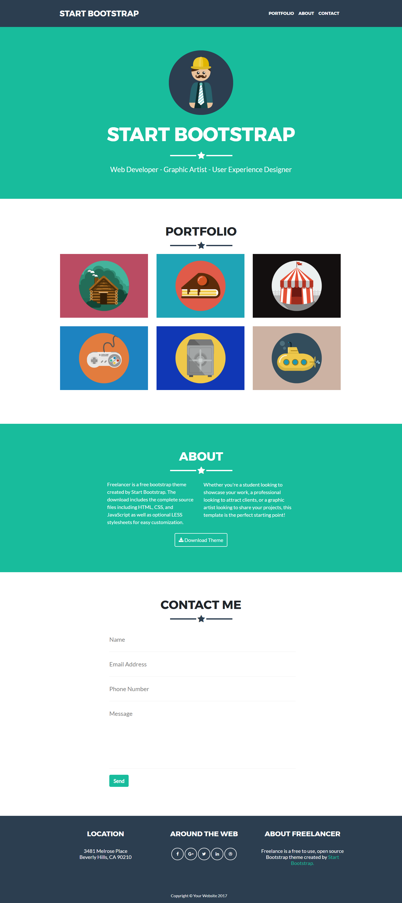

# FREELANCER

* **Curso:** _Creando tu primer sitio web interactivo_
* **Unidad:** _Maquetado web con HTML & CSS_

***

## OBJETIVO:

El reto consiste en replicar el sitio de **Freelancer**, este será el resultado
a lograr:

## ESTRUCTURA HTML

### ETIQUETAS UTILIZADAS:

### Contenedores:

* **header:** Se utilizó como contenedor del navegador y del logo.
* **section:** Se utilizó como contenedor de Home, Portfolio, About, Contact.
* **footer:** Se utilizo como contenedor del Footer.
* **div:** Se utilizó como contenedor de varios.
* **form:** Se utilizó como contenedor de los imput's.
* **nav:** Se utlizó como contenedor de el navegador.
* **a:** Se utilizó como contenedor de iconos.
* **ul:** Se utilizó como una lista.

### Construcción:

* **h1:** Se utilizó para títulos.
* **p:** Se utilizó para párrafos.
* **img:** Se utilizó para colorcar imágenes.
* **li:** Se utilizo para lista.
* **input:** Se utilizó para formularios.

## Consideraciones:

* Esta web utiliza 2 tipografías: `Montserrat` y `Lato`.
* La paleta de colores son los siguientes: `#2c3e50`, `#18bc9c`,
  `#212529`.

## RESULTADO OBTENIDO:

### **Autora:** Laura Jiménez Hidalgo ( Laboratoria - Bootcamp )